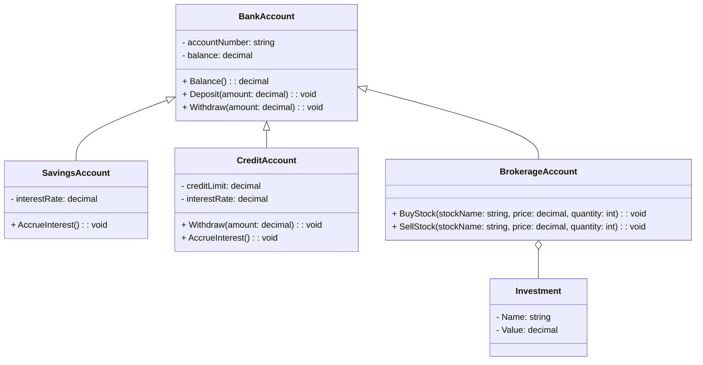

# Лабараторная 2 
Студент: Гришенок Даниил Андреевич Группа: 305

```mermaid
classDiagram
    class BankAccount {
        - accountNumber: string
        - balance: decimal
        + Balance(): decimal
        + Deposit(amount: decimal): void
        + Withdraw(amount: decimal): void
    }

    class SavingsAccount {
        - interestRate: decimal
        + AccrueInterest(): void
    }

    class CreditAccount {
        - creditLimit: decimal
        - interestRate: decimal
        + Withdraw(amount: decimal): void
        + AccrueInterest(): void
    }

    class BrokerageAccount {
        + BuyStock(stockName: string, price: decimal, quantity: int): void
        + SellStock(stockName: string, price: decimal, quantity: int): void
    }

    class Investment {
        - Name: string
        - Value: decimal
    }

    BankAccount <|-- SavingsAccount
    BankAccount <|-- CreditAccount
    BankAccount <|-- BrokerageAccount
    BrokerageAccount o-- Investment
```

